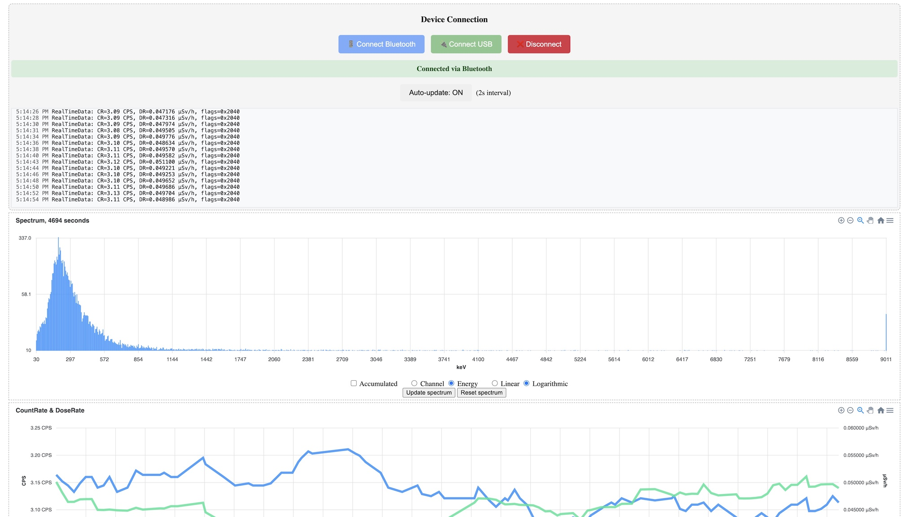

# radiacode-web

A web-based interface for RadiaCode radiation detection devices.

## About

This project is based on [https://github.com/cdump/radiacode](https://github.com/cdump/radiacode) and provides a browser-based interface for connecting to and interacting with RadiaCode devices.

## Usage

1. Clone this repo: `git clone https://github.com/bsharper/radiacode-web`
2. Open `index.html` in a Chrome-based browser (Chrome, Edge, or other Chromium-based browsers)
3. Click "Connect Bluetooth" to connect to your RadiaCode device

## Requirements

- Chrome-based browser with Web Bluetooth API support
- RadiaCode device with Bluetooth capability

## Note

USB connectivity is not currently working. Please use Bluetooth connection only.

## License

See the [LICENSE](LICENSE) file for details.
